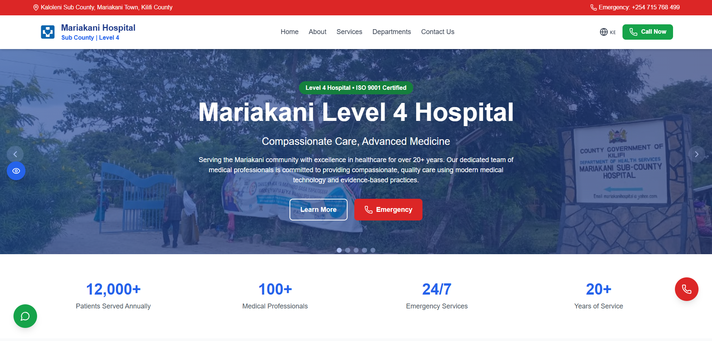
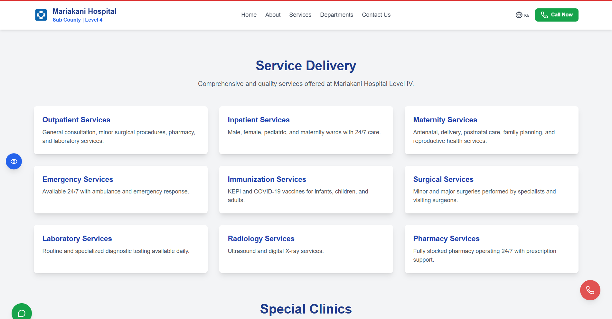
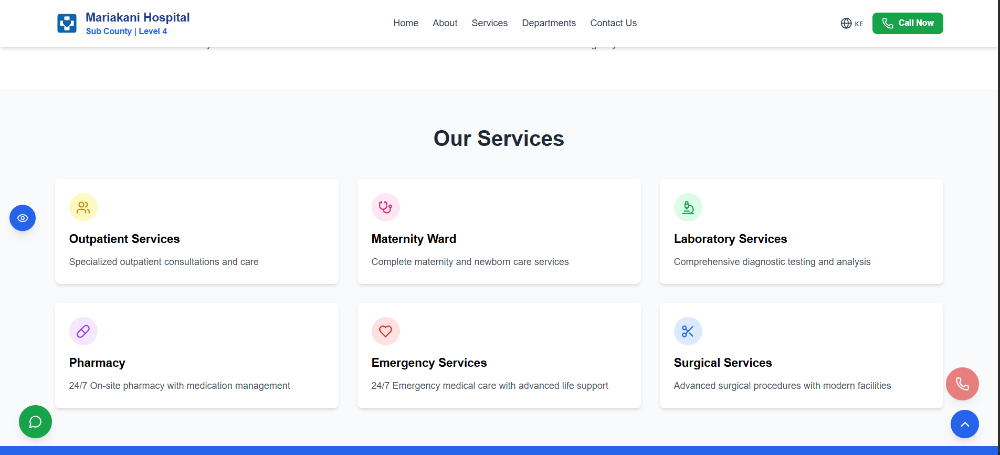
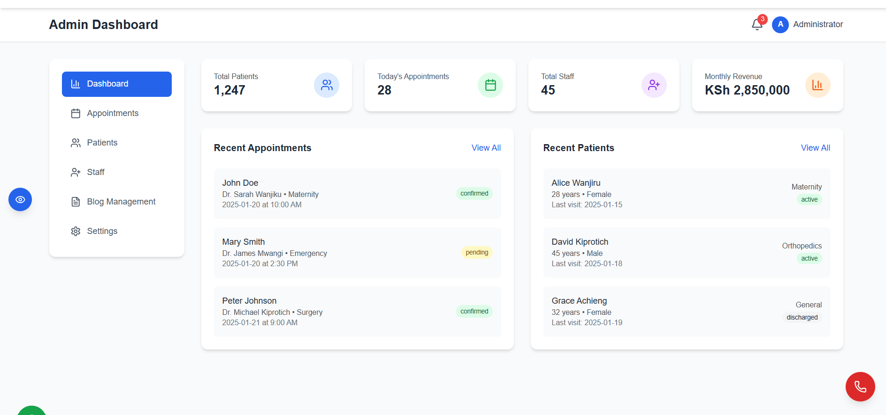
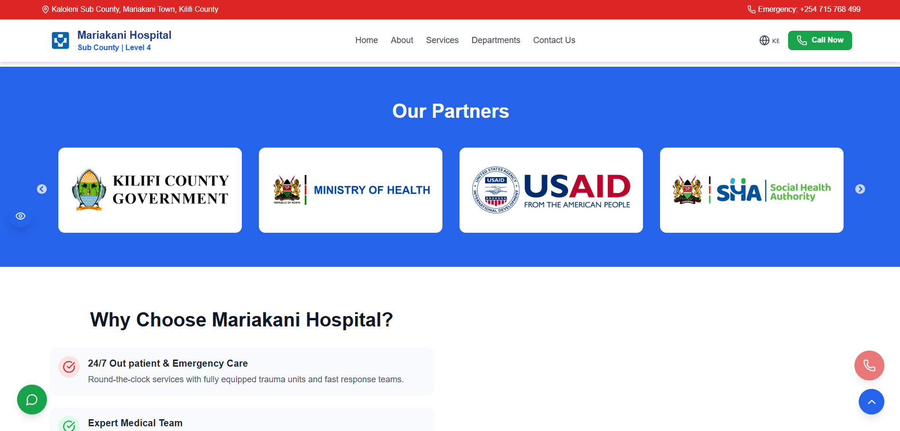

# 👋 Hi, I'm **Eric Nzyoka**  

> ### Fullstack | Cloud | MERN | 

🎓 Software Engineering graduate with a strong foundation in modern development stacks, especially the **MERN** stack.  
🛠️ Skilled in building **robust, scalable, and secure backend systems** with seamless frontend integration.  
☁️ Experienced in **Python, PHP, JavaScript, MySQL, Firebase**, and cloud deployment (GCP, Azure).  
📈 Always exploring new technologies, delivering impactful projects, and solving real-world problems with code.  

>### Currently Learning

``Generative AI – Building Generative AI Applications``

- Learning cutting-edge Generative AI skills for creating text, images, music and videos.
- Delivered by AI PhDs and industry experts, blending theory with hands-on projects, weekly tutorials, and a final hackathon.
- Uses the BCS Jaseci Lab ecosystem for practical experience in integrating and deploying AI applications.

Prepares learners for high-impact roles as AI transforms healthcare, agriculture, finance, education and transportation.

>### Tech Stack

#### 🔹 Programming & Development
| Languages | Frontend | Backend | IT Support |
|-----------|----------|---------|------------|
|  |  |  |  |
|  |  |  |  |
|  |  |  |  |
|  |  |  |  |
|  |  |  |  |
|  |  |  |  |

#### 🔹 Databases, Tools & Cloud
| Databases | Tools | Cloud & DevOps | Hosting & Deployment |
|-----------|-------|----------------|----------------------|
|  |  |  |  |
|  |  |  |  |
|  |  |  |  |
|  |  |  |  |
|  |  |  |  |

#### 🔹 AI, FinTech & Other Skills
| FinTech & Payments | AI & ML | Mobile & Messaging | Other Tools |
|--------------------|---------|--------------------|-------------|
|  |  |  |  |
|  |  |  |  |
|  |  |  |  |

>## Featured Projects

### 1️⃣ **HREdge – Smart HR Platform for Kenyan SMEs**
💼 A Human Resources platform designed for SMEs in Kenya.  
🚀 Features: Payroll (with M-Pesa), AI recruitment, leave management, chatbot support, and mobile-first design.  

🔗 [Live Demo](https://smes-edgehr.netlify.app/)  

  
Project UI images

  
  
  

---

### 2️⃣ **MtaaniFix – AI-Powered Service Booking Platform**
🔧 A platform connecting Kenyans with verified fundis via WhatsApp + AI matching.  
🚀 Features: AI WhatsApp bot, GPS-based booking, M-Pesa payments, dashboards for Admins, Fundis & Customers.  

🔗 [Live Demo](https://mtaanifix-ke.netlify.app/) | [WhatsApp Bot](https://mtaani-fix.netlify.app/whatsapp-bot)  

  
 Project UI images

  
  
  
  
  

---

### 3️⃣ **Mariakani Sub-County Hospital Website**
🏥 Responsive, multilingual hospital website with mobile-first design.  

🔗 [Live Demo](https://mariakani-hospital-website.vercel.app/) 

  
 Project UI images

  
  
  
  
 

 

✅ Role: **Front-End Developer / UI & UX Lead**  
✅ Built **responsive, mobile-first UI** with Swahili & English support  
✅ Developed dynamic components: carousel, services, contact forms  
✅ Ensured **SEO, accessibility (WCAG 2.1)** & performance optimization  

**Skills:** React 18, TypeScript, Tailwind CSS, Framer Motion, SEO, Accessibility 

---

### 4️⃣ **Customer Management & Billing System**
💳 Role-based billing app for businesses.  

🔗 [GitHub Repo](https://github.com/nzyoka10/wbcms)  

✅ Client login, Revenue reports, Print-ready invoices  

---

### 5️⃣ **WemaCARE – AI-Powered Healthcare App**
🤖 Mobile app for AI-driven symptom analysis via photo, voice, and text.  

🔗 [Live preview](https://mariakani-hospital-website.vercel.app/)  | [Watch Demo](https://www.youtube.com/watch?v=srX_OrCV0hE&feature=youtu.be)

✅ Role: **Backend & AI Integration Lead**  
✅ Integrated AI models for photo, voice, and text symptom analysis  
✅ Implemented **offline-first architecture** with local sync  
✅ Optimized for **low-end devices** to minimize crashes  

**Skills:** React Native, TypeScript, Node.js, AI Integration, Offline-first, Performance Optimization  

---

### 6️⃣ **Bank Marketing API**
📊 A RESTful API to manage customer data and marketing campaigns.  

🔗 [GitHub Repo](https://github.com/nzyoka10/database-optimization-project)  

✅ CRUD operations, Indexed queries, Swagger docs  

>## GitHub Activity

<picture>
  <source media="(prefers-color-scheme: dark)" srcset="https://raw.githubusercontent.com/nzyoka10/nzyoka10/output/github-snake-dark.svg" />
  <source media="(prefers-color-scheme: light)" srcset="https://raw.githubusercontent.com/nzyoka10/nzyoka10/output/github-snake.svg" />
  
</picture>

