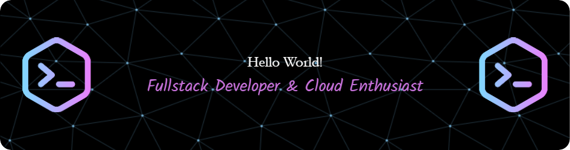
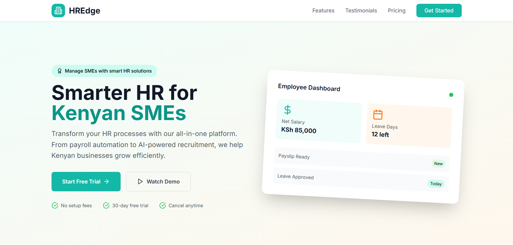
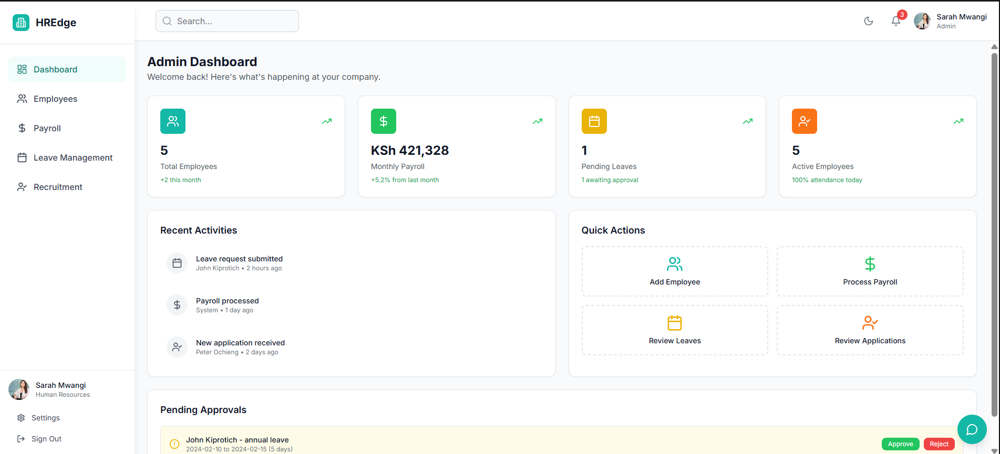
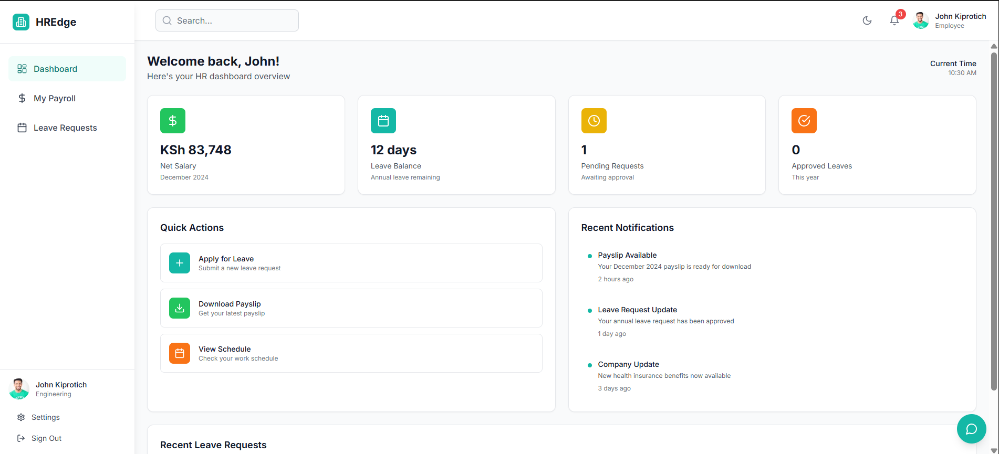
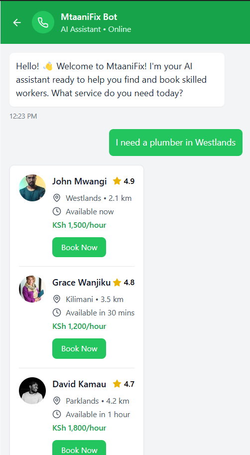
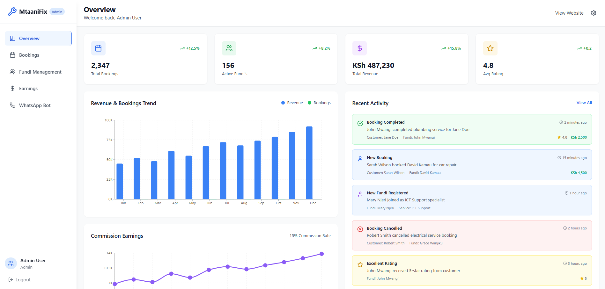
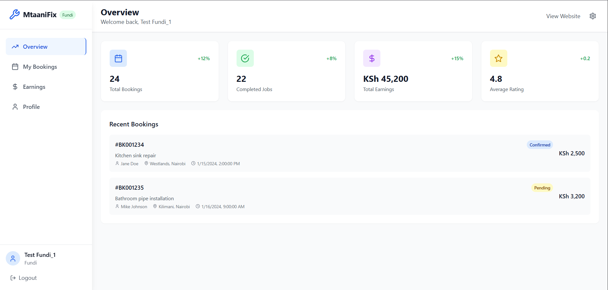
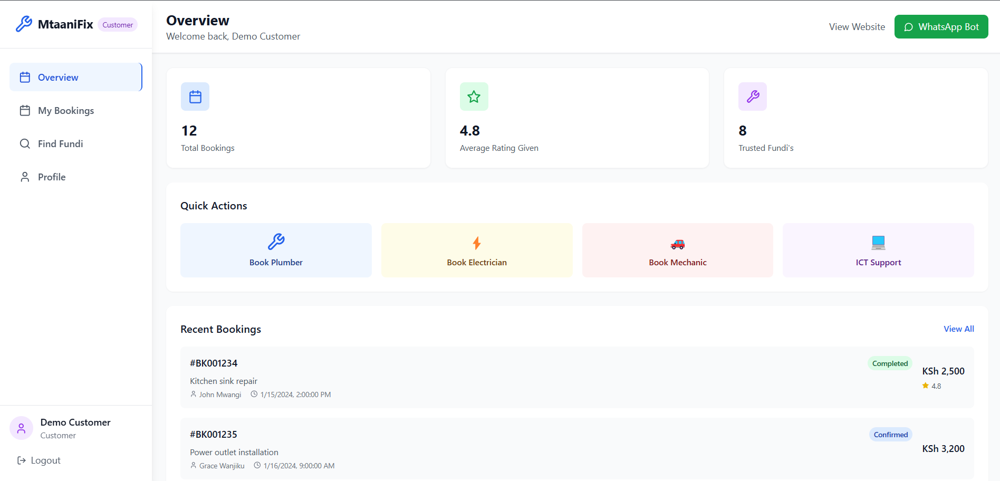
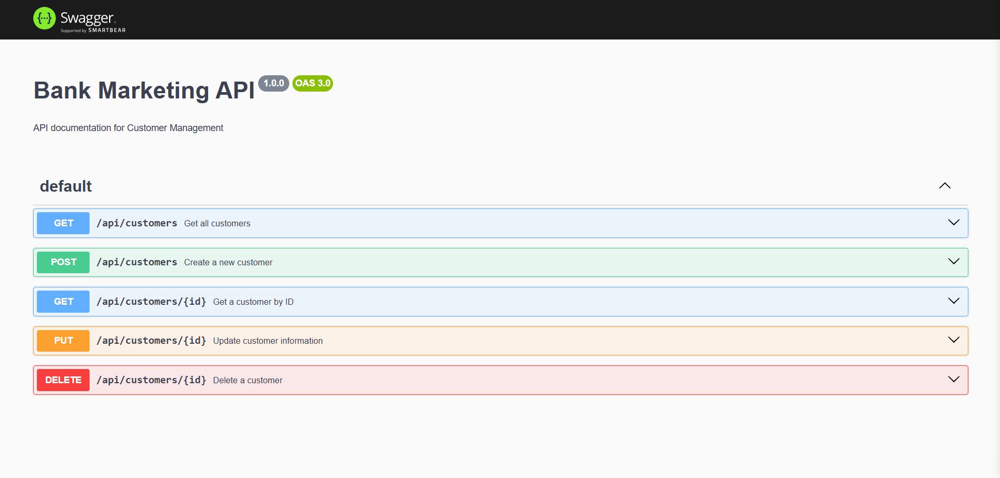
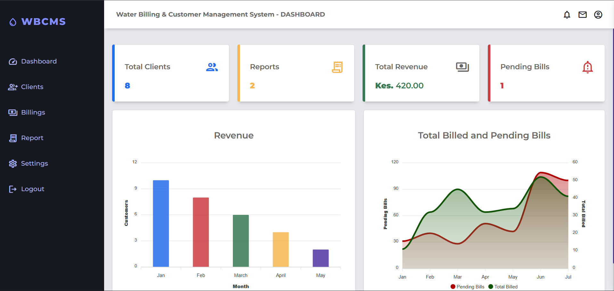

## 👋 Hi there, I'm **Eric Nzyoka**  
### 💻 Fullstack Developer | ☁️ Cloud Enthusiast | 🚀 MERN

🎓 Trained in Software Engineering with a strong foundation in modern development stacks including the **MERN** stack.  
🛠️ Passionate about building robust, scalable, and secure backend systems with seamless frontend integration.  
☁️ Proficient in **Python**, **PHP**, **JavaScript**, **MySQL**, **Firebase**, and deploying solutions on modern cloud platforms.  
📈 Constantly exploring new technologies, contributing to impactful projects, and solving real-world problems with code.

---

| 🖥️ Programming & Scripting | ⚛️ Frontend Development | 🌐 Backend Development | 🗃️ Databases & Services |
|----------------------------|--------------------------|-------------------------|--------------------------|
|  |  |  |  |
|  |  |  |  |
|  |  |  |  |
|  |  |  |  |
|  |  |  |  |
|  |  |  |  |

| 🔧 Development Tools | ☁️ Cloud & DevOps | 🌍 Hosting & Deployment | 💰 FinTech & Payments |
|----------------------|-------------------|--------------------------|------------------------|
|  |  |  |  |
|  |  |  |  |
|  |  |  |  |
|  |  |  |  |
|  |  |  |  |
|  |  |  |  |

| 🤖 AI & Machine Learning | 📱 Mobile & Communication | 🧰 Other Skills |  |
|--------------------------|----------------------------|-----------------|--|
|  |  |  |  |
|  |  |  |  |
|  |  |  |  |
|  |  |  |  |
|  |  |  |  |
|  |  |  |  |

## 🧠 Projects

### 1. ``HREdge`` - Smart HR Platform for Kenyan SMEs

A Human Resources management system built specifically for Small and Medium Enterprises in Kenya. 
- HREdge streamlines HR processes with modern technology while addressing local business needs and compliance requirements.

> Live demo: [View](https://smes-edgehr.netlify.app/)

  
HREdge - UI Screenshots

   - Landing page

 - Admin Dashboard

 - Employee Dashboard

  
Learn more about HREdge

## Features

### Admin Dashboard
- Real-time analytics and KPI tracking
- Employee overview with department insights
- Pending approvals management
- Quick action shortcuts

### Employee Management
- Comprehensive employee profiles
- Department-wise organization
- Advanced search and filtering
- Employee status tracking

### Smart Payroll System
- Automated salary calculations
- Kenyan tax compliance (PAYE, NHIF, NSSF)
- M-Pesa integration for direct payments
- Downloadable payslips
- Payroll reporting and analytics

### Leave Management
- Digital leave applications
- Approval workflow system
- Leave balance tracking
- SMS/WhatsApp notifications
- Multiple leave types (Annual, Sick, Maternity, Emergency)

### AI-Powered Recruitment
- Intelligent CV parsing
- Automated candidate scoring
- Skills-based matching
- Application tracking system
- Interview scheduling

### HR Chatbot
- 24/7 employee support
- Instant answers to HR queries
- Payroll information lookup
- Leave balance inquiries
- Policy guidance

### Mobile-First Design
- Responsive web interface
- SMS integration
- WhatsApp notifications
- Progressive Web App capabilities

## 🛠️ Tech Stack

- **Frontend:** React 18 + TypeScript
- **Styling:** Tailwind CSS
- **Routing:** React Router DOM
- **Icons:** Lucide React
- **Build Tool:** Vite
- **State Management:** React Context API

### 2. ``MtaaniFix`` - AI-Powered Service Booking Platform

An intelligent platform connecting Kenyans with verified skilled workers through WhatsApp integration and AI-powered matching. Revolutionizing how people find and book trusted professionals across Kenya.

> Live demo: [View Demo](https://mtaanifix-ke.netlify.app/) | WhatsApp Bot: [Try Demo](https://mtaani-fix.netlify.app/whatsapp-bot)

  
MtaaniFix - UI Screenshots

  
### Landing Page

### WhatsApp AI Bot Interface  

### Admin Dashboard

### Fundi (Service Provider) Dashboard

### Customer Dashboard

  
Learn more about MtaaniFix

## Features

### AI-Powered WhatsApp Bot
- Natural language processing for service requests
- Intelligent fundi matching based on location and ratings
- Real-time booking confirmations and updates
- 24/7 automated customer support
- Smart conversation flow with context awareness

### Comprehensive Service Categories
- **Plumbing:** Kitchen/bathroom repairs, pipe installation, drainage
- **Electrical:** Wiring, solar installation, power systems
- **Mechanics:** Vehicle repairs, diagnostics, maintenance
- **ICT Support:** Computer repair, network setup, software installation

### Advanced Fundi Management
- Rigorous verification and background checking
- Skills assessment and specialty certification
- Real-time availability tracking
- Performance analytics with detailed ratings
- Earnings dashboard with commission transparency

### Smart Booking System
- AI-powered matching algorithm
- GPS-based location matching
- Dynamic pricing based on demand
- Automated scheduling with conflict resolution
- Multi-channel notifications (SMS, WhatsApp, Email)

###  Payment Integration
- M-Pesa integration for instant payments
- Transparent pricing with detailed breakdowns
- Automatic commission calculations
- Secure escrow system
- Digital receipts and transaction history

### Business Intelligence Dashboard
- Real-time KPIs and performance metrics
- Revenue analytics with trend analysis
- Geographic service distribution mapping
- Customer satisfaction tracking
- Predictive analytics for demand forecasting

### Trust & Safety Features
- Comprehensive background verification
- Insurance coverage options
- Dispute resolution system
- Quality assurance protocols
- Emergency support and escalation

## 🛠️ Tech Stack

### Frontend
- **React 18 + TypeScript** for type-safe development
- **Tailwind CSS** for responsive styling
- **React Router DOM** for navigation
- **Lucide React** for iconography
- **Recharts** for data visualizations
- **Vite** for fast development builds

### Backend & Database
- **Supabase** as Backend-as-a-Service
- **PostgreSQL** with Row Level Security
- **Real-time subscriptions** for live updates
- **Edge Functions** with Deno runtime
- **Automated backups** and recovery

### AI & Integrations
- **Claude AI API** for natural language processing
- **WhatsApp Business API** for messaging
- **Africa's Talking SMS** for notifications
- **M-Pesa API** for mobile payments
- **Google Maps API** for location services

### DevOps
- **Netlify** for deployment and CDN
- **GitHub Actions** for CI/CD
- **Environment-based configurations**
- **Performance monitoring**

-----

#### 3. Bank Marketing API  
*Node.js • Express.js • PostgreSQL*  
- A RESTful API to manage customer data and marketing campaigns.  

✅ Features:
- CRUD operations
- Indexed queries for fast responses
- Swagger documentation

🔗 [GitHub Repo](https://github.com/nzyoka10/database-optimization-project)

---

#### 4.Customer Management & Billing System  
*PHP • MySQL • Bootstrap*  
- A role-based web billing app for businesses.  

✅ Features:
- Client login & role access
- Revenue and transaction reports
- Print-ready invoice output

🔗 [GitHub Repo](https://github.com/nzyoka10/wbcms)

---

#### 5. School Website  
*HTML • CSS (Bootstrap) • JavaScript*  
- A school website to showcase school activites

✅ Features:
- Responsive design
- Hero section with background
- News section with scrolling effect
- Academic section with accordion menu
- Gallary and Contact form 

🔗 [Live Demo](https://bright001.netlify.app)  

---

#### 6. 🏪 Online Store (E-Commerce Platform)  
*Flask • MySQL • Bootstrap*  
- A fully responsive e-commerce platform with:
- Product management
- User login & checkout flow
- Mpesa payments

🔗 [GitHub Repo](https://github.com/nzyoka10/online-store)

---

<picture>
  <source media="(prefers-color-scheme: dark)" srcset="https://raw.githubusercontent.com/nzyoka10/nzyoka10/output/github-snake-dark.svg" />
  <source media="(prefers-color-scheme: light)" srcset="https://raw.githubusercontent.com/nzyoka10/nzyoka10/output/github-snake.svg" />
  
</picture>

---

### 📫 Let's Connect!

- 💼 LinkedIn: [Get in touch](https://linkedin.com/in/ericnzyoka)  
- 💻 GitHub: [Portfolio](https://#!)

