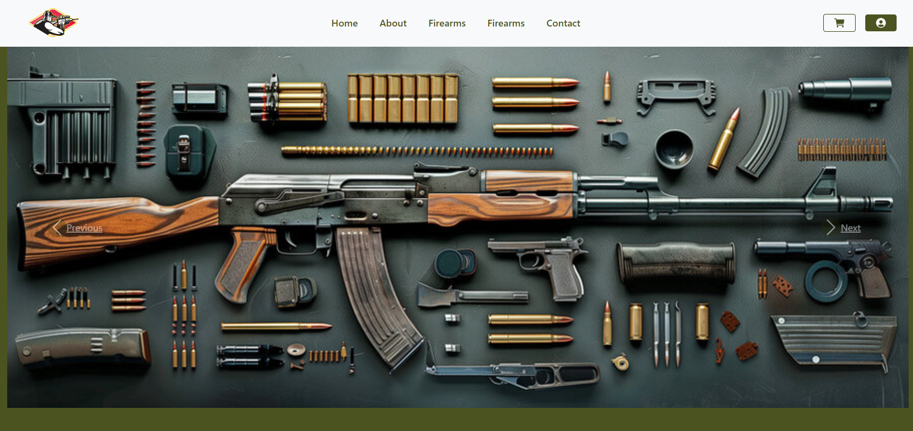
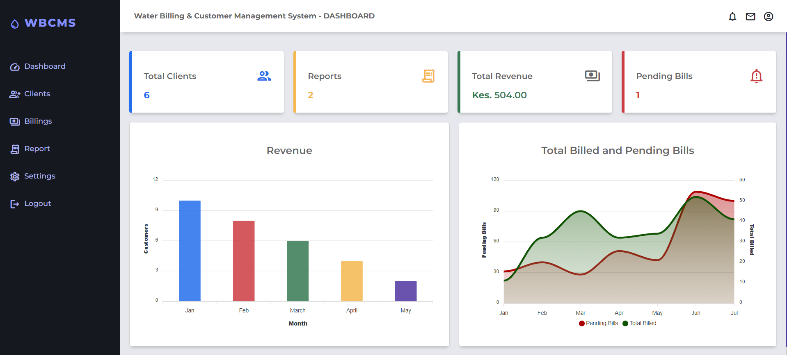
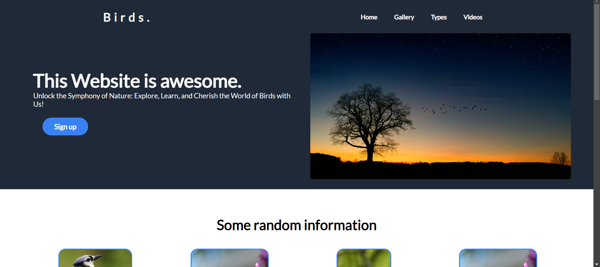
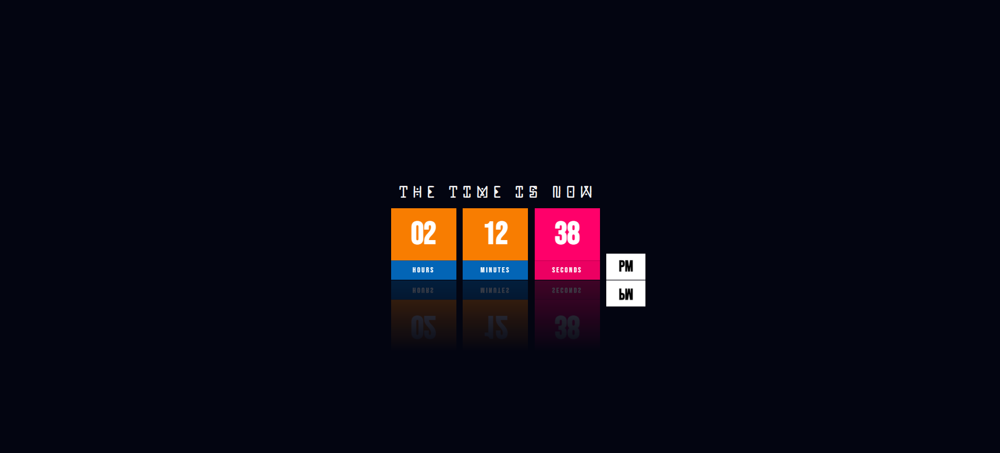

### Jambo! I'm Eric 👋

###

I'm a Junior developer from Nairobi, Kenya. I'm really into making cool websites and web applications.

- 🔭 Right now, I'm learning Kotlin for Mobile dev.
- 🌱 I'm good at using `Python` for **Backend Development**
- ⚡ Fun fact: I'm always super happy!
- 📫 You can find me on [Instagram][Instagram].
- 

### 💻 Technical Skills:

- Technologies I've been working with recently:-

  
  
  
  
  
  
  
  
  
  
  
  
  
  
  
  
  
  
  
  
  
  
  
  
  
  
  
  
  
  
  
  
  
  
  
  
  
  
  
  
  
  
  
  
  
  
  

###

  
  
  
  
  

###

## Projects Showcase

  
Click To Expand

| **Project Name**                 | **Screenshot/Description**                                                                                                                                              | **Tools Used**                                                                               | **Project Repository**                                    |
| -------------------------------------- | ----------------------------------------------------------------------------------------------------------------------------------------------------------------------------- | -------------------------------------------------------------------------------------------------- | --------------------------------------------------------------- |
| **Firearms Store**               | ` ` FireArmPro is an online store where users can browse and purchase various types of firearms.                           | HTML, CSS, and Bootstrap, a robust backend using Python-Flask, and secure data storage with MySQL. | [Live Preview](https://kra.go.ke/)                                 |
| **Water Billing Management App** |  ` ` Utility application designed to bill water accounts based on customer consumption | HTML, CSS(Bootstrap), JavaScript, PHP, MySQL (Hosting)                                             | [Live Preview](https://kra.go.ke/)                                 |
| **ToDo App**                     |  ` ` Simple **ToDo App**, where users can key in their tasks and the list is displayed in a table.                                      | HTML, CSS, JavaScript, Netlify (Hosting)                                                           | [Live Preview](https://t-list-app.netlify.app/)                    |
| **Landing Page**                 |  ` ` A simple landing page about different species of birds!                                                                                  | HTML & CSS                                                                                         | [Live Preview](https://nzyoka10.github.io/landing_page/index.html) |
| **Simple Clock**                 |  ` ` A project showing real-time using JavaScript!                                                                                           | HTML, CSS & JavaScript                                                                             | [Live Preview](https://clock-digita.netlify.app/)                  |

  
:zap: GitHub Stats

` `

<!--  -->

  
:zap: Most Used Languages

[website]: https://nzyoka-developer.com/
[YouTube]: https://www.youtube.com/watch?v=rWMuEIcdJP4&ab_channel=Codecademy
[instagram]: https://www.instagram.com/_byte.bard__
[linkedin]: https://linkedin.com/in/eric-nzyoka
