### Jambo! I'm Eric 👋

###

I'm a **Software Developer** from **Nairobi, Kenya** with a passion for creating dynamic websites and web applications.  

- 🔭 **What I'm working on:** Learning **Kotlin** for mobile development to expand my skills.  
- 🌱 **What I'm good at:** Building robust **backends** with **Python** and frameworks like Flask and Django.  
- 💻 **What I love:** Tackling real-world problems with clean, scalable code.  
- ⚡ **Fun fact:** I'm always super excited and ready to learn!  
- 📫 **Let's connect:** Find me on [Instagram][Instagram].  

### 💻 Technical Skills:

Technologies I've been working with recently:

| **Frontend** | **Backend** | **Databases** | **Other Tools** |
|--------------|-------------|---------------|-----------------|
|  HTML5 |  Python |  MySQL |  Git |
|  CSS3 |  PHP |  SQLite |  GitHub |
|  Bootstrap |  Flask |  PostgreSQL |  VSCode |
|  JavaScript |  Django |  MongoDB |  Linux |
|  |  Firebase |  Redis |  Azure |
|  |  Kotlin |  |  AWS |
|  |  Insomnia |  |  |

## 💻 My Projects

   
Projects

---

### 1. **Project Name:** Online Store  
**Description:**  
An online store with a user-friendly interface built using **HTML**, **CSS**, and **Bootstrap**, a secure backend powered by **Python Flask** and **MySQL**, and integrated secure payments via the **Mpesa API**.

#### Project Images:  

   
Click to view images

   - **Homepage**  
     
   
   - **Login Page**  
     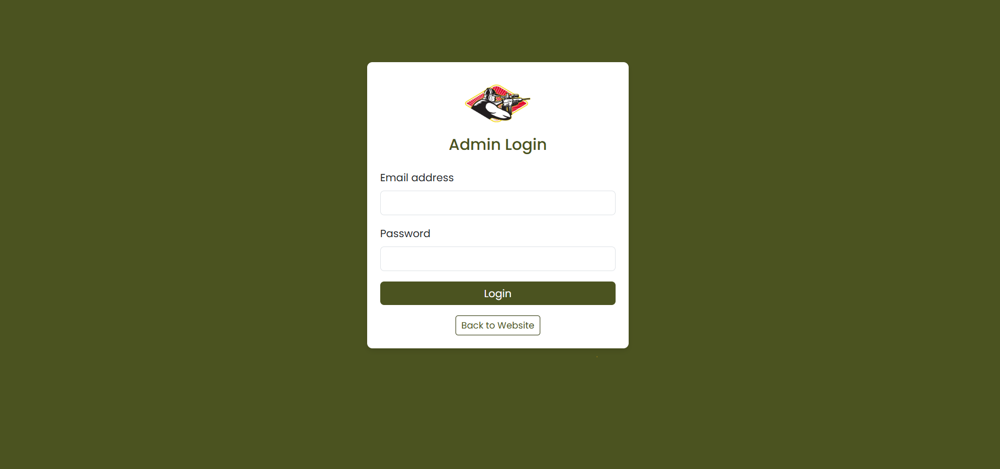

   - **Admin Dashboard**  
     

   - **Items Listing**  
     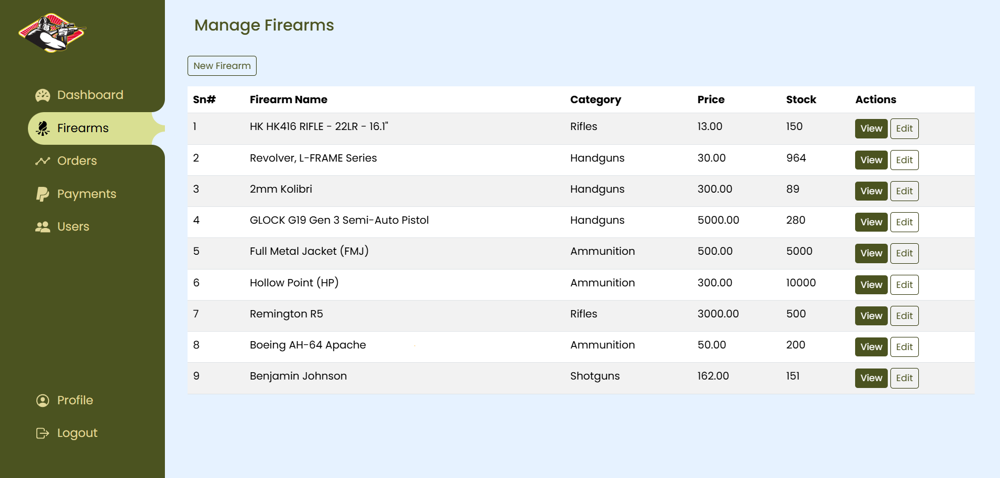
   
   - **Add New Item**  
     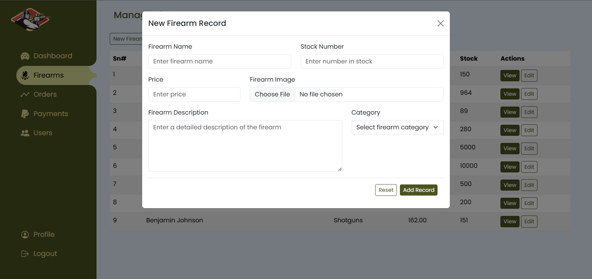

   - **Orders Listing**  
     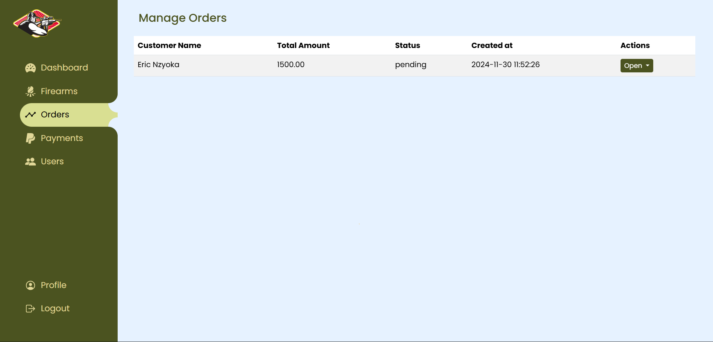
   
   - **Payments Listing**  
     

---

### 2. **Project Name:** Billing App  
**Description:**  
A water billing and customer management system built with PHP and MySQL, designed for efficient billing, record-keeping, and streamlined customer management.

#### Project Images:  

   
Click to view images

   - **Login page**  
     
   
   - **Admin Dashboard**  
     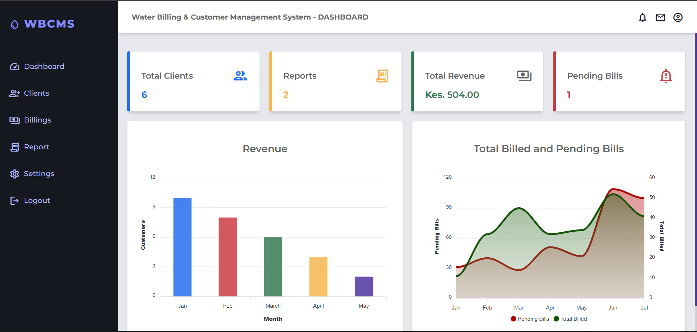

   - **Listing of Clients**  
     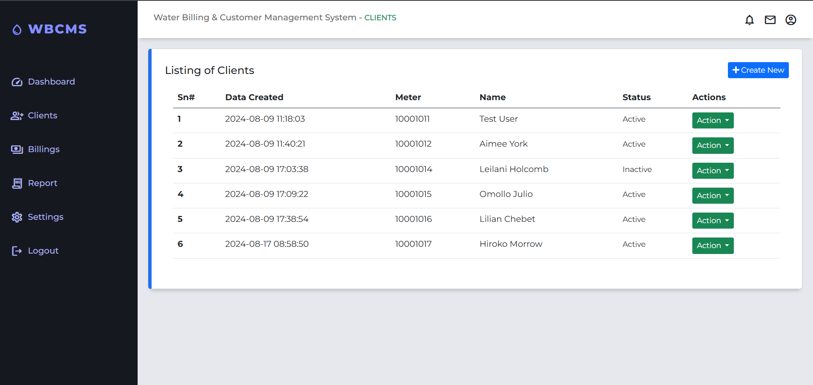

   - **New client**
   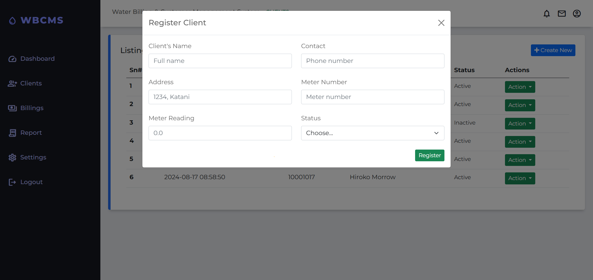

  - **Listing of Billing**
   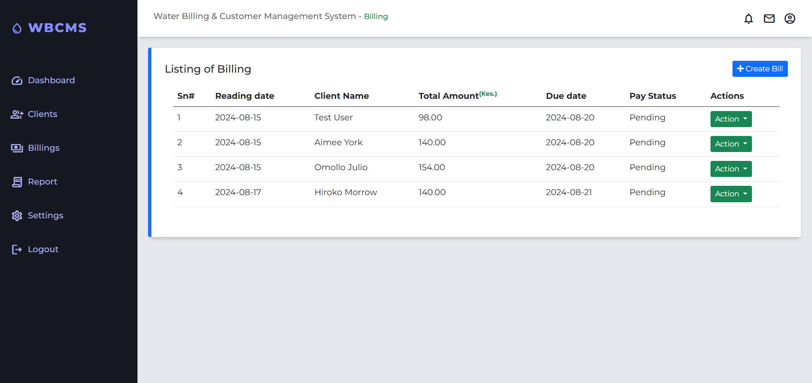

  - **Generate bill**
   

  - **Reports**
   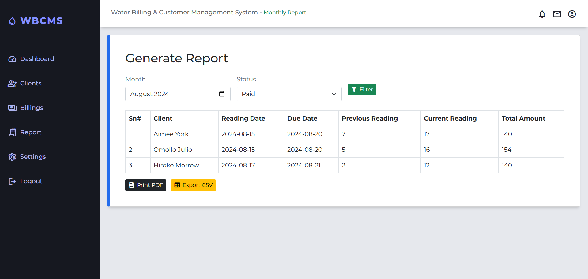

  - **APP Settings**
   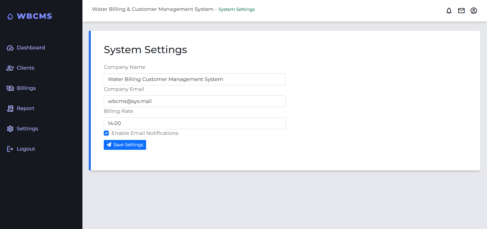

---

### 3. **Project Name:** AfyaMind  
**Description:**  
AfyaMind is a web platform offering accessible and culturally relevant mental health resources for young adults in Kenya. It aims to reduce stigma and provide tools to manage stress and mental health issues.

#### Project Images:  

   
Click to view images

   - **Homepage**  
     
     
   - **About page**
     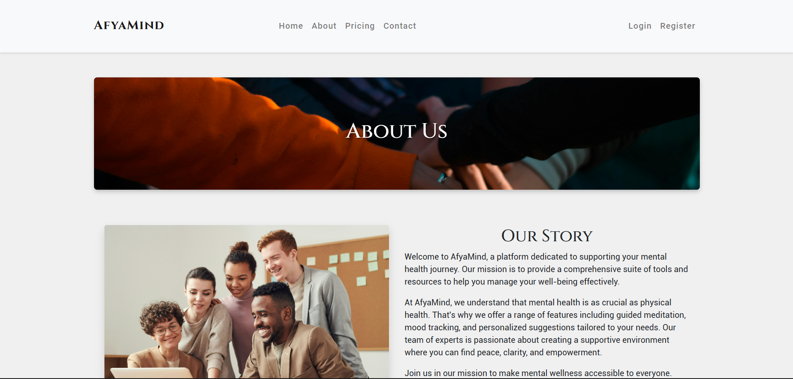
   
   - **User Login**  
     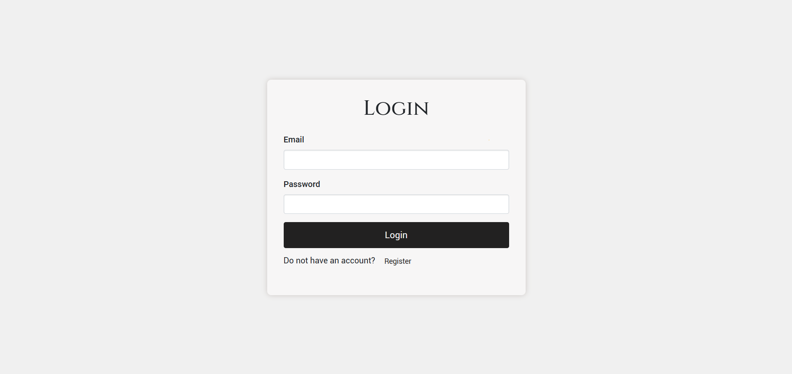

   - **User Dashboard**  
     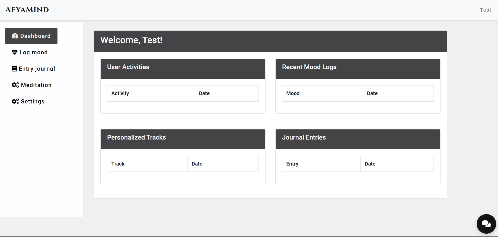

   - **Log Mood**  
     

   - **Journal Entry** 
     
    

---

### 4. **Project Name:** Toyota Supra  
**Description:**  
Welcome to the ultimate Toyota Supra fan site! Discover the iconic Supra’s history, explore different models, and browse a gallery of stunning images. Built with HTML, CSS (Bootstrap), and JavaScript, this site offers a modern and engaging experience for car enthusiasts, celebrating the Supra’s legacy and design excellence.

#### Project Images:  

   
Click to view images

   - **Landing Page**  
     
   
   - **About Page**  
     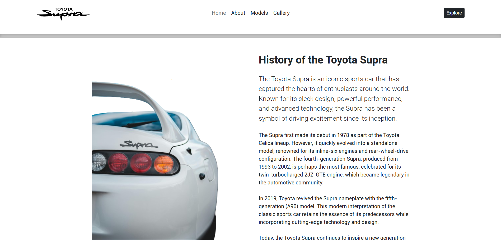

   - **Models Page**  
       
     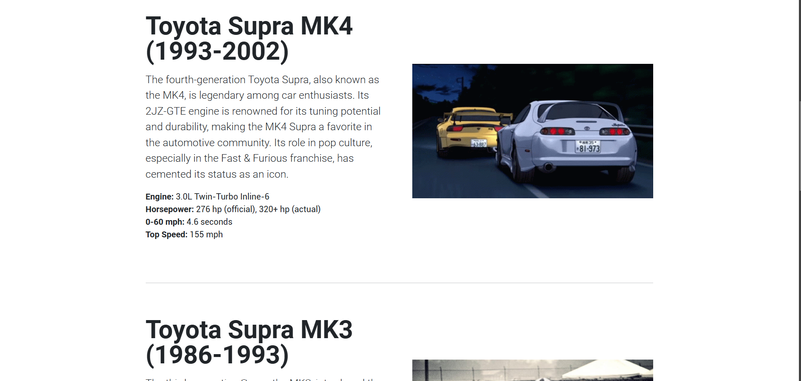

   - **Gallery Page**  
     

  

##### Socials

  
  
  
  
  

###

  
:zap: GitHub Stats

<!--  -->

  
:zap: Most Used Languages

[website]: https://nzyoka-developer.co/
[YouTube]: https://www.youtube.com/watch?v=rWMuEIcdJP4&ab_channel=Codecademy
[instagram]: https://www.instagram.com/nzyoka10
[linkedin]: https://linkedin.com/in/ericnzyoka
