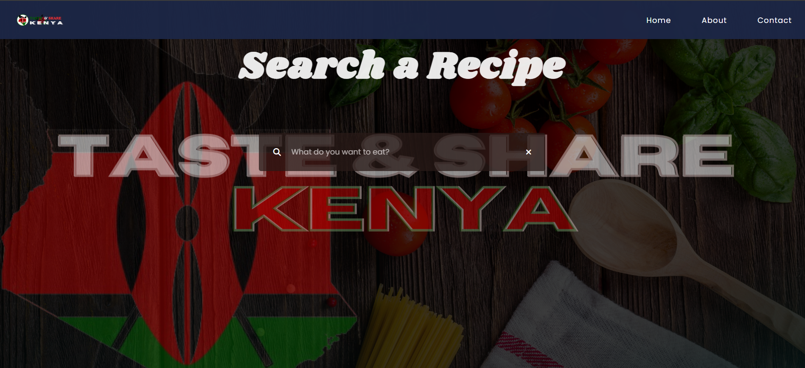

### Jambo! I'm Eric 👋

I'm a Junior developer from Nairobi, Kenya. I'm really into making cool websites and web applications.

- 🔭 Right now, I'm learning a lot in a course.
- 🌱 I'm getting good at using the `MERN Stack` for making websites.
- 👯 I'd love to help out with any open-source projects.
- 💬 If you have any questions about making websites, just ask!
- ⚡ Fun fact: I'm always super happy!
- 📫 You can find me on [Instagram](https://www.instagram.com/nzyok10/).

I can't wait to meet other people who love making cool stuff too!
<!-- - 🤔 I’m looking for help with Flutter -->

### Projects:

- Below are some of the projects have worked on.

Click To Expand.

<!-- projects table -->

| Project Name | Screenshot/Description | Tools Used | Project Repository |
|--------------|------------------------|------------|--------------------|
| **Portfolio Website** |    My personal portfolio website, showcasing my skills, experience, and projects as a software developer. | HTML, CSS, JavaScript, Google Fonts, Media Queries | [Click me](#) |
| **ToDo App** |    This form validates user input for name, email, and message fields, ensuring all are filled correctly before sending an email via JavaScript. | HTML, CSS, JavaScript, Netlify `(Hosting)` | [Click me](https://contac-me.netlify.app/) |
| **Taste & Share Kenya** |    This is a recipe website that showcases different types of **Kenyan dishes**. Enjoy! | HTML, CSS, JavaScript, Google Script `(Database)`, GitHub | [Click me](https://taste-kenya.netlify.app/) |

### 💻 Tech Stack:
  - Technologies I've been working with recently:-
######
 
 
 
 
 

 
 
 
 

 
 
 
 

 
 

 
 
 

 
 

######

  
:zap: GitHub Stats

 
<!--  -->

  
:zap: Most Used Languages

[website]: https://nzyoka-developer.com/
[YouTube]: https://www.youtube.com/watch?v=rWMuEIcdJP4&ab_channel=Codecademy
[instagram]: https://www.instagram.com/_byte.bard__
[linkedin]: https://linkedin.com/in/eric-nzyoka

