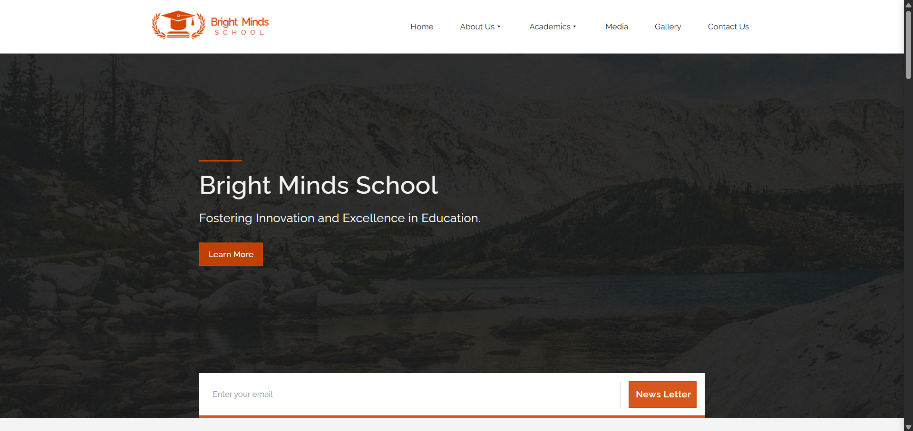

## Hi 👋, I'm Eric Nzyoka — Fullstack Developer & Cloud Enthusiast

🎓 Software Engineering | `MERN` | 
💻 Fullstack developer passionate about building scalable backend systems and cloud-powered solutions  
☁️ Skilled in Python, PHP, JavaScript, MySQL, Firebase, and cloud infrastructure  
🚀 Always building, learning, and looking for opportunities to contribute to impactful software projects

---

#### 🖥️ **Programming & Scripting**

#### 🌐 **Web Development**

#### 🗃️ **Databases**

#### 🔧 **Tools & Platforms**

#### ☁️ **Cloud & DevOps**

#### 🌍 **Hosting & Deployment**

#### 🧰 **Other Skills**

---

### 🧠 Projects

# HREdge - Smart HR Platform for Kenyan SMEs

A Human Resources management system built specifically for Small and Medium Enterprises in Kenya. 
- HREdge streamlines HR processes with modern technology while addressing local business needs and compliance requirements.

> Live demo: [View](https://hredge-v1.netlify.app/)

 - Landing page

 - Admin Dashboard

 - Employee Dashboard

  
Learn more about HREdge

## 🌟 Features

### 🏢 Admin Dashboard
- Real-time analytics and KPI tracking
- Employee overview with department insights
- Pending approvals management
- Quick action shortcuts

### 👥 Employee Management
- Comprehensive employee profiles
- Department-wise organization
- Advanced search and filtering
- Employee status tracking

### 💰 Smart Payroll System
- Automated salary calculations
- Kenyan tax compliance (PAYE, NHIF, NSSF)
- M-Pesa integration for direct payments
- Downloadable payslips
- Payroll reporting and analytics

### 📅 Leave Management
- Digital leave applications
- Approval workflow system
- Leave balance tracking
- SMS/WhatsApp notifications
- Multiple leave types (Annual, Sick, Maternity, Emergency)

### 🤖 AI-Powered Recruitment
- Intelligent CV parsing
- Automated candidate scoring
- Skills-based matching
- Application tracking system
- Interview scheduling

### 💬 HR Chatbot
- 24/7 employee support
- Instant answers to HR queries
- Payroll information lookup
- Leave balance inquiries
- Policy guidance

### 📱 Mobile-First Design
- Responsive web interface
- SMS integration
- WhatsApp notifications
- Progressive Web App capabilities

## 🛠️ Tech Stack

- **Frontend:** React 18 + TypeScript
- **Styling:** Tailwind CSS
- **Routing:** React Router DOM
- **Icons:** Lucide React
- **Build Tool:** Vite
- **State Management:** React Context API

#### 1. 📊 Bank Marketing API  
*Node.js • Express.js • PostgreSQL*  
- A RESTful API to manage customer data and marketing campaigns.  

✅ Features:
- CRUD operations
- Indexed queries for fast responses
- Swagger documentation

🔗 [GitHub Repo](https://github.com/nzyoka10/database-optimization-project)

---

#### 2. 💸 Billing System  
*PHP • MySQL • Bootstrap*  
- A role-based web billing app for businesses.  

✅ Features:
- Client login & role access
- Revenue and transaction reports
- Print-ready invoice output

🔗 [GitHub Repo](https://github.com/nzyoka10/wbcms)

---

#### 3. 🏫 School Website  
*HTML • CSS (Bootstrap) • JavaScript*  
- A school website to showcase school activites

✅ Features:
- Responsive design
- Hero section with background
- News section with scrolling effect
- Academic section with accordion menu
- Gallary and Contact form 

🔗 [Live Demo](https://bright001.netlify.app)  

---

#### 4. 🏪 Online Store (E-Commerce Platform)  
*Flask • MySQL • Bootstrap*  
- A fully responsive e-commerce platform with:
- Product management
- User login & checkout flow
- Mpesa payments

🔗 [GitHub Repo](https://github.com/nzyoka10/online-store)

---

<picture>
  <source media="(prefers-color-scheme: dark)" srcset="https://raw.githubusercontent.com/nzyoka10/nzyoka10/output/github-snake-dark.svg" />
  <source media="(prefers-color-scheme: light)" srcset="https://raw.githubusercontent.com/nzyoka10/nzyoka10/output/github-snake.svg" />
  
</picture>

---

### 📫 Let's Connect!

- 💼 LinkedIn: [Get in touch](https://linkedin.com/in/ericnzyoka)  
- 💻 GitHub: [Portfolio](https://#!)

