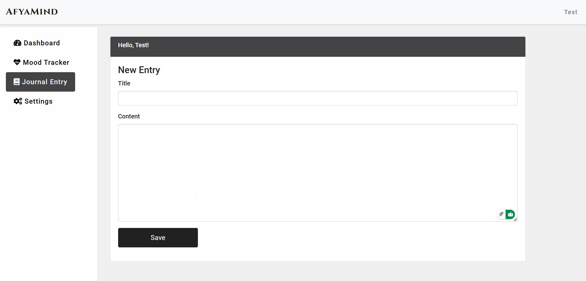

### Jambo! I'm Eric 👋

###

I'm a **Software Developer** from **Nairobi, Kenya** with a passion for creating dynamic websites and web applications.  

- 🔭 **What I'm working on:** Learning **Kotlin** for mobile development to expand my skills.  
- 🌱 **What I'm good at:** Building robust **backends** with **Python** and frameworks like Flask and Django.  
- 💻 **What I love:** Tackling real-world problems with clean, scalable code.  
- ⚡ **Fun fact:** I'm always super excited and ready to learn!  
- 📫 **Let's connect:** Find me on [Instagram][Instagram].  

### 💻 Technical Skills:

Technologies I've been working with recently:

| **Frontend** | **Backend** | **Databases** | **Other Tools** |
|--------------|-------------|---------------|-----------------|
|  HTML5 |  Python |  MySQL |  Git |
|  CSS3 |  PHP |  SQLite |  GitHub |
|  Bootstrap |  Flask |  PostgreSQL |  VSCode |
|  JavaScript |  Django |  MongoDB |  Linux |
|  |  Firebase |  Redis |  Azure |
|  |  Kotlin |  |  AWS |
|  |  Insomnia |  |  |

## 💻 My Projects

Here’s a well-structured table to display your projects and their details:

| **Project Name**   | **Description**                                                                                       | **Technologies Used**                        | **Key Features**                                                                                  | **Image Previews**                                                                                                                                                                                                                                                        |
|---------------------|-------------------------------------------------------------------------------------------------------|---------------------------------------------|----------------------------------------------------------------------------------------------------|--------------------------------------------------------------------------------------------------------------------------------------------------------------------------------------------------------------------------------------------------------------------------|
| **Online Store**    | An online store with a user-friendly interface, secure backend, and Mpesa payments integration.       | HTML, CSS, Bootstrap, Python Flask, MySQL   | User-friendly UI, Admin Dashboard, Secure Payments, Order Management                              | - Homepage:    - Admin Dashboard:    - Payments:                                                                                            |
| **Billing App**     | A water billing and customer management system for efficient record-keeping and streamlined billing. | PHP, MySQL                                  | Client Management, Billing System, Reports, Settings                                              | - Login Page:    - Dashboard:    - Generate Bill:                                                                                        |
| **AfyaMind**        | A web platform offering culturally relevant mental health resources and tools to manage stress.      | HTML, CSS, Bootstrap, Python Flask, SQLite  | Mood Tracking, Journaling, Mental Health Resources                                                | - Homepage:    - Log Mood:    - Journal Entry:                                                                                                 |
| **Toyota Supra**    | A fan site showcasing the Toyota Supra’s history, models, and a stunning gallery.                    | HTML, CSS (Bootstrap), JavaScript           | Landing Page, Gallery, Models Page, About Page                                                    | - Landing Page:    - Models Page:    - Gallery Page:                                                                                              |

<!-- -------------------------------------------------------------- -->

##### Socials

  
  
  
  
  

###

  
:zap: GitHub Stats

<!--  -->

  
:zap: Most Used Languages

[website]: https://nzyoka-developer.co/
[YouTube]: https://www.youtube.com/watch?v=rWMuEIcdJP4&ab_channel=Codecademy
[instagram]: https://www.instagram.com/nzyoka10
[linkedin]: https://linkedin.com/in/ericnzyoka
